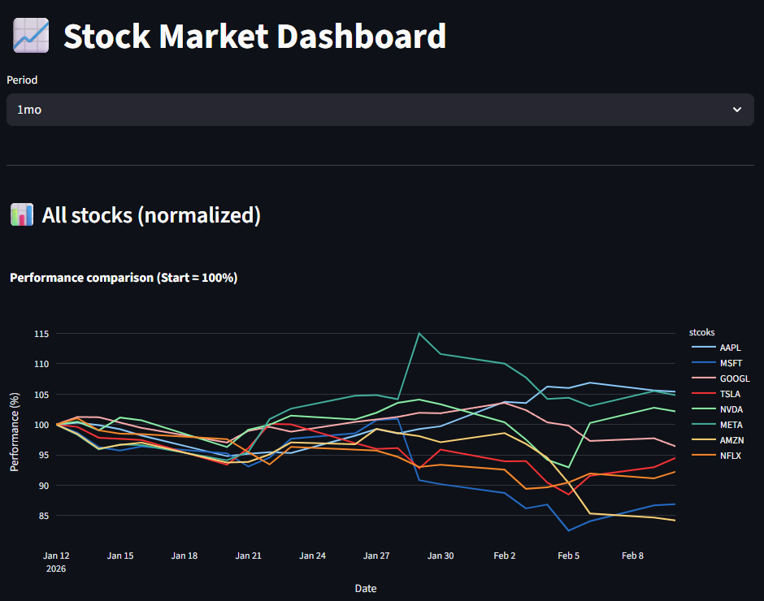

# 📈 Stock Market Dashboard

An interactive Streamlit dashboard for visualizing and comparing stock market performance using real-time data from Yahoo Finance.


## 📋 Table of Contents

- [About the Project](#about-the-project)
- [Features](#features)
- [Demo](#demo)
- [Installation](#installation)
- [Usage](#usage)
- [Technologies](#technologies)
- [Project Structure](#project-structure)
- [API Information](#api-information)
- [Possible Extensions](#possible-extensions)
- [License](#license)

## 🎯 About the Project

This project is an **interactive stock market dashboard** that allows users to compare the performance of major tech stocks over different time periods. It uses the Yahoo Finance API via the `yfinance` library to fetch real-time stock data and normalizes the results for easy comparison.

## ✨ Features

- 📊 **Multi-Stock Comparison** - Compare up to 6 major tech stocks simultaneously
- 🔄 **Flexible Time Periods** - Choose from 1 month, 3 months, 6 months, or 1 year
- 📈 **Normalized Visualization** - All stocks start at 100% for easy performance comparison
- 💹 **Real-Time Data** - Fetches current stock prices from Yahoo Finance
- 🎨 **Interactive Charts** - Zoom, pan, and hover for detailed information
- 💻 **Responsive Design** - Wide layout for optimal data visualization

## 🖼️ Demo

### Dashboard Overview


### Stock Comparison Chart
Shows normalized performance where all stocks start at 100%, making it easy to compare percentage gains/losses regardless of absolute stock price.

## 🚀 Installation

### Prerequisites

- Python 3.10 or higher
- pip (Python Package Manager)
- Git (optional)

### Step-by-Step Guide

1. **Clone the repository** (or download as ZIP):
   ```bash
   git clone https://github.com/Ni-o-iN/stock-market-dashboard.git
   cd stock-market-dashboard
   ```

2. **Create a virtual environment** (recommended):
   
   **Windows:**
   ```bash
   python -m venv venv
   venv\Scripts\activate
   ```
   
   **Mac/Linux:**
   ```bash
   python3 -m venv venv
   source venv/bin/activate
   ```

3. **Install dependencies:**
   ```bash
   pip install -r requirements.txt
   ```

4. **Run the dashboard:**
   ```bash
   streamlit run app.py
   ```

5. **Open your browser:**
   - The dashboard will open automatically at `http://localhost:8501`
   - If not, open the link manually in your browser

## 💡 Usage

### Dashboard Components

1. **Time Period Selector**

2. **Stock Comparison Chart**
   - Displays normalized performance of all selected stocks
   - All stocks start at 100% for easy comparison
   - Interactive features:
     - Hover over lines to see exact values
     - Click on legend items to show/hide stocks
     - Double-click to reset view
     - Zoom and pan for detailed analysis

### Included Stocks

The dashboard tracks the following major tech stocks:
- **AAPL** - Apple Inc.
- **MSFT** - Microsoft Corporation
- **GOOGL** - Alphabet Inc. (Google)
- **TSLA** - Tesla, Inc.
- **NVDA** - NVIDIA Corporation
- **META** - Meta Platforms, Inc. (Facebook)
- **AMZN** -Amazon
- **NFLX** -Netflix  

### Understanding Normalization

The chart shows **percentage change** from the start of the selected period:
- **100%** = Starting point (first day)
- **105%** = +5% gain since start
- **95%** = -5% loss since start

This makes it easy to compare stocks regardless of their absolute price:
- A $300 stock going to $330 = +10%
- A $30 stock going to $33 = +10%
- Both show the same growth on the normalized chart!

## 🛠️ Technologies

| Technology | Usage |
|------------|-----------|
| **Python 3.10+** | Programming language |
| **Streamlit 1.30.0+** | Web dashboard framework |
| **yfinance** | Yahoo Finance API wrapper |
| **Plotly Express** | Interactive visualizations |
| **Pandas** | Data manipulation and analysis |

## 📁 Project Structure

```
stock-market-dashboard/
│
├── app.py                                # Main dashboard application
├── requirements.txt                      # Python dependencies
└── stock-market-dashboard-overview.png   # Git ignore rules
```

## 🌐 API Information

### Yahoo Finance (via yfinance)

- **Library:** `yfinance` (Python wrapper)
- **Data Source:** Yahoo Finance
- **Authentication:** None required
- **Rate Limit:** Fair use (reasonable requests)
- **Data Type:** Historical and real-time stock data

**Available Data:**
- Open, High, Low, Close prices
- Trading volume
- Dividends
- Stock splits

**Supported Ticker Symbols:**
- US stocks: `AAPL`, `MSFT`, etc.
- International stocks: `SAP` (Germany), `NESN.SW` (Switzerland)
- Indices: `^GSPC` (S&P 500), `^DJI` (Dow Jones)

**Note:** While yfinance is convenient and free, it's not an official Yahoo Finance API. For production applications, consider using a paid financial data API.

## 📝 License

This project is licensed under the MIT License – see the [LICENSE](LICENSE) file for details.
